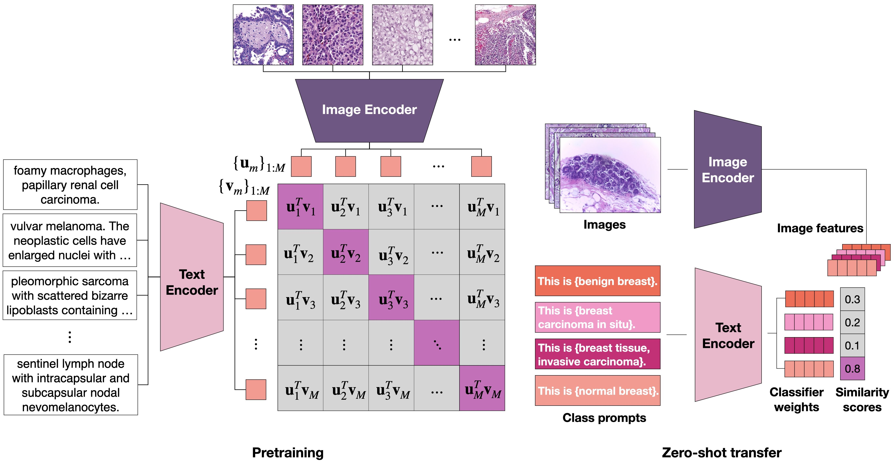

# MI-Zero

<details>
<summary>
  <b>Visual Language Pretrained Multiple Instance Zero-Shot Transfer for Histopathology Images</b>, CVPR 2023. 
  <a href="https://openaccess.thecvf.com/content/CVPR2023/html/Lu_Visual_Language_Pretrained_Multiple_Instance_Zero-Shot_Transfer_for_Histopathology_Images_CVPR_2023_paper.html" target="blank">[HTML]</a>
  <a href="https://arxiv.org/abs/2306.07831"
target="blank">[ArXiv]</a>
  <a href="https://www.youtube.com/watch?v=x8Ch5wsCJRw"
target="blank">[Video]</a>
  <a href="#cite">[Cite]</a>
  

Ming Y. Lu*, Bowen Chen*, Andrew Zhang, Drew F. K. Williamson, Richard J. Chen, Tong Ding, Long Phi Le, Yung-Sung Chuang, Faisal Mahmood
</summary>

```
@InProceedings{Lu_2023_CVPR,
    author    = {Lu, Ming Y. and Chen, Bowen and Zhang, Andrew and Williamson, Drew F. K. and Chen, Richard J. and Ding, Tong and Le, Long Phi and Chuang, Yung-Sung and Mahmood, Faisal},
    title     = {Visual Language Pretrained Multiple Instance Zero-Shot Transfer for Histopathology Images},
    booktitle = {Proceedings of the IEEE/CVF Conference on Computer Vision and Pattern Recognition (CVPR)},
    month     = {June},
    year      = {2023},
    pages     = {19764-19775}
}
```
</details>


© **This code and corresponding models are made available for non-commercial academic purposes** and is licenced under the [Creative Commons Attribution Non Commercial No Derivatives 4.0 International](https://creativecommons.org/licenses/by-nc-nd/4.0/) license. Commercial entities may contact us or the Mass General Brigham Innovations office.

# Installation

To install dependencies, clone the repository and

```{bash}
conda env create -f env.yml
conda activate mizero
pip install ./assets/timm_ctp.tar --no-deps
```

# How to use 

## Data

MI-Zero can be applied to any dataset of whole slide images. In our paper, we reported results primarily from an in-house dataset. For reproducibility, we also tested on some subsets of WSIs from [The Cancer Genome Atlas](https://portal.gdc.cancer.gov/). These results are in the Supplementary Material of the paper. Below we provide a quick example using a subset of cases for TCGA RCC subtyping. 

## Prepare patches
To extract patches from WSIs, we used [CLAM](https://github.com/mahmoodlab/CLAM), but other packages can be used as long as the patching outputs are stored in the .h5 format, where each .h5 file refers to a WSI and the 'coords' key points to a numpy array of N x 2 coordinates for N patches from that WSI. 

## Prepare patch embeddings for MI-Zero
The script assumes wsis are .svs files and extracts embeddings using 20x patches:

```shell
python extract_embeddings.py --csv_path ./data_csvs/tcga_rcc_zeroshot_example.csv --h5_source <path_to_h5_files> --wsi_source <path_to_wsi_files> --save_dir <where_to_save_embeddings> --ckpt_path <path_to_checkpoint> --device cuda:0
```

## Inference on whole slide images
To run MI-Zero after extracting patch embeddings, use *slidelevel_zeroshot_multiprompt.py*. An example command is provided for TCGA RCC subtyping:

```shell
python slidelevel_zeroshot_multiprompt.py --task RCC_subtyping --embeddings_dir <path_to_rcc_embeddings> --dataset_split ./data_csvs/tcga_rcc_zeroshot_example.csv --topj 1 5 50 --prompt_file ./prompts/rcc_prompts.json --model_checkpoint ./logs/ctranspath_448_bioclinicalbert/checkpoints/epoch_50.pt 
```

## Pretrained models


Since some of our models were pretrained on proprietary in-house data, we are only able to release encoder weights that were pretrained entirely on publicly available data. The checkpoints can be found [here](https://drive.google.com/drive/folders/1AR9agw2WLXes5wz26UTlT_mvJoUY38mQ?usp=share_link). 

Specificaly, we release two models trained with bioclinicalbert and pubmedbert as the text encoder respectively.
- `bioclinicalbert`: `ctranspath_448_bioclinicalbert/checkpoints/epoch_50.pt`
- `pubmedbert`: `ctranspath_448_pubmedbert/checkpoints/epoch_50.pt`

Once the weights are downloaded, they should be placed into the ./src/logs/ directory, such that their relative paths to MI-Zero are:
-  `./src/ctranspath_448_bioclinicalbert/checkpoints/epoch_50.pt`
- `./src/ctranspath_448_pubmedbert/checkpoints/epoch_50.pt`

# Contact

For any questions, please open new issues our reach out to us over email at <mingylu@mit.edu> or <bchen18@bwh.harvard.edu>.

# Acknowledgements

The repo was partly inspired by open source repositories such as [openclip](https://github.com/mlfoundations/open_clip),  [timm](https://github.com/huggingface/pytorch-image-models/) and [huggingface transformers](https://github.com/huggingface/transformers). We thank the authors and developers for their contribution.

# License

This work is under the [Creative Commons Attribution Non Commercial No Derivatives 4.0 International](https://creativecommons.org/licenses/by-nc-nd/4.0/) license.

# Funding
This work was funded by NIH NIGMS [R35GM138216](https://reporter.nih.gov/search/sWDcU5IfAUCabqoThQ26GQ/project-details/10029418).

<a name="cite"></a>
# Citation
If you find our work useful, please cite our paper:
Lu, M.Y., Chen, B., Zhang, A., Williamson, D.F., Chen, R.J., Ding, T., Le, L.P., Chuang, Y.S. and Mahmood, F., 2023. Visual Language Pretrained Multiple Instance Zero-Shot Transfer for Histopathology Images. In Proceedings of the IEEE/CVF Conference on Computer Vision and Pattern Recognition (pp. 19764-19775).
```
@InProceedings{Lu_2023_CVPR,
    author    = {Lu, Ming Y. and Chen, Bowen and Zhang, Andrew and Williamson, Drew F. K. and Chen, Richard J. and Ding, Tong and Le, Long Phi and Chuang, Yung-Sung and Mahmood, Faisal},
    title     = {Visual Language Pretrained Multiple Instance Zero-Shot Transfer for Histopathology Images},
    booktitle = {Proceedings of the IEEE/CVF Conference on Computer Vision and Pattern Recognition (CVPR)},
    month     = {June},
    year      = {2023},
    pages     = {19764-19775}
}
```
